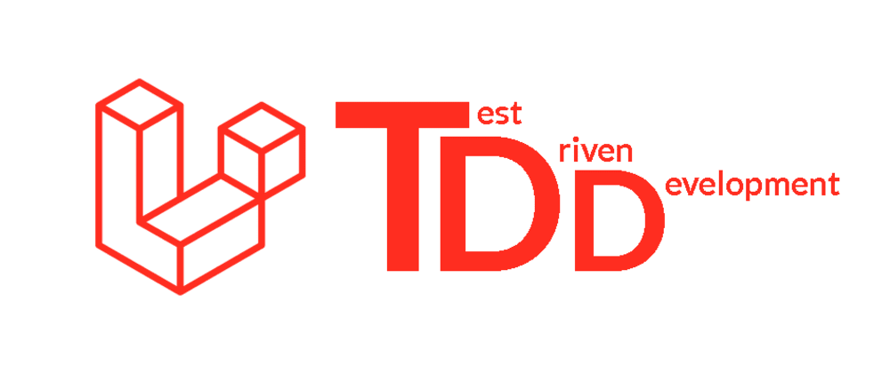
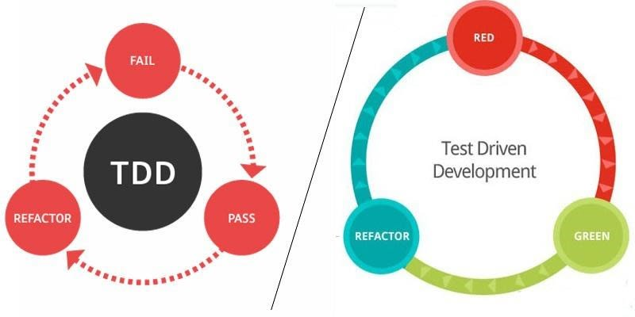

# Laravel 8 tests - Usando PHPUnit com Laravel

<p align="center"><a href="https://laravel.com" target="_blank"></a></p>

`php artisan db:seed --class=UsersSeeder`

`php artisan route:list`

## executar 

`vendor/bin/phpunit`

## Pasta tests do laravel

## Feature
Testar os recursos

## Unit
Fazer testes unitarios

## browser
para fazer testes funcionalidade, simulando uma pessoa navegando no seu projeto

## Teoria - diferença de unit e feature?
> Resumindo: testes unitários focam no ponto de vista do desenvolvedor, em classes e tem uma visão mais direta. Testes de feature costumam ver as coisas do ponto de vista do usuário, testando o que o usuário fará, tendo uma visão mais ampla.

> Ideal limitando o tamanho do metodo em 100 caracteres, separado por _

> no .env local é bom colocar a porta do serve. 
`APP_URL=http://localhost:8000`


> usando anotetion = /** @test */

```php
    /**
     * UnitOfWork_StateUnderTest_ExpectedBehavior
     * ActionVerb_WoOrWhatToDo_ExpectedBehavior
     * check_if_user_column_is_correct
     * 
     */
```

php artisan make:controller CustomerController --resource

## testando somente uma classe de test

vendor/bin/phpunit --filter only_logged_in_users_can_see_customers_list

## unit
```
php artisan make:test UserTest --unit
vendor/bin/phpunit --filter check_if_user_column_is_correct
vendor/bin/phpunit --filter upload_file_test
php artisan make:test CustomerTest
```

## Testes de login

`vendor/bin/phpunit --filter test_login`

# laravel dusk - serve para fazer tests de browser
composer require --dev laravel/dusk
php artisan dusk:install
php artisan dusk:make RegisterUserTest
php artisan dusk --filter check_if_login_function_is_working
php artisan dusk --filter check_if_register_function_is_working

## Modo de uso | Running Tests
`php artisan test --filter check_if_user_column_is_correct`


Para tornar o comando para executar o PHPUnit relacionável, abra o arquivo composer.json e adicione o comando test à seção de scripts, conforme mostrado abaixo:

```json
{
    ...
    "scripts": {
        ...,
        "test": [
            "vendor/bin/phpunit"
        ]
    }
}
```

## Running Tests
`composer test`
`php artisan test`

## Tests composer
`php artisan test test_compose`

## clear
```sh
php artisan config:cache

```

<p align="center"><a href="https://laravel.com" target="_blank"></a></p>
<p align="center"><a href="https://laravel.com" target="_blank"></a></p>

## Install Laravel 8
```sh
   composer create-project laravel/laravel laravel-test
   cd laravel-test/
   ls
   code .
   composer require laravel/jetstream
   composer require laravel/ui
   composer require ui bootstrap --auth
   composer require laravel/jetstream
   php artisan config:cach
   php artisan migrate
   php artisan jetstream:install livewire
   npm install && npm run dev
   php artisan jetstream:install livewire/inertia
   php artisan jetstream:install inertia
   php artisan config:cach
   php artisan migrate
   npm install && npm run dev
   sudo npm install n -g
   sudo n stable
   npm install && npm run dev
```   

> Please note that you should also update your call to User factory: factory('App\User')->create()->id;

> Here is the relevant documentation: https://laravel.com/docs/8.x/database-testing#creating-models

> However, if you prefer to use the Laravel 7.x style factories, you can use the package laravel/legacy-factories You may install it with composer:
## Laravel 7.x style factories

`composer require laravel/legacy-factories`

- https://laravel.com/docs/8.x/testing
- https://www.youtube.com/watch?v=f3tD-K796xo
- https://www.youtube.com/watch?v=IRrxbGjKW3s
- https://phpunit.de/
- https://phpunit.readthedocs.io/pt_BR/latest/
- https://www.twilio.com/blog/unit-testing-laravel-api-phpunit
- https://auth0.com/blog/testing-laravel-apis-with-phpunit/

# Renato Lucena - 2021